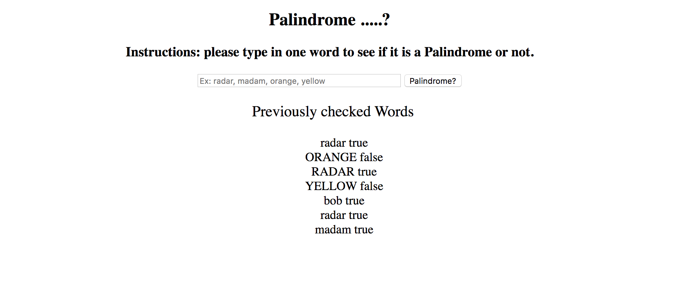

# 📊 Project: Server Side Palindrome Checker

* **Project Title: Palindrome**
  - "Palindrome" is a webpage that allows you to type in words to see if they are a palindrome or not. You are also able to view words that were previously checked.

* **Image of project**

* **Image of project in use**

## How It's Made:

**Tech Used:** HTML5, CSS3, API's, Javascript, Node.js, mongoDB, Express framework

* **Getting Started:**
## Installation:

1. Clone repo
2. run `npm install`

## How To Use:

1. run `node server.js`
2. Navigate to `localhost:3000`
